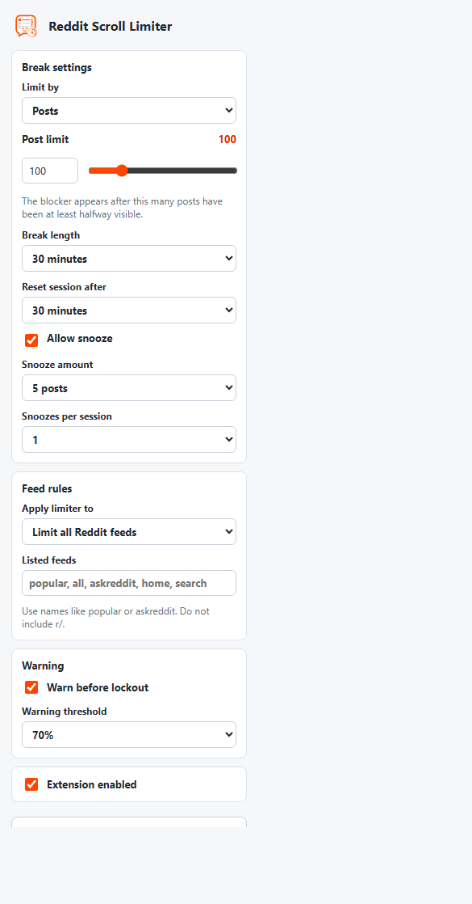

# Reddit Scroll Limiter

A Manifest V3 Chrome extension that adds a finite-scroll guardrail to Reddit. Set a post or time limit, browse normally, and the extension shows a break message when you reach the limit.



## Features

- Adjustable viewed-post limit.
- Optional time-based limit.
- Configurable break length and session reset window.
- Snooze controls for short extensions.
- Warning banner before the limit is reached.
- Subreddit allowlist/blocklist rules.
- Temporary disable controls for one hour, the current session, or the current feed.
- Modern Reddit in-feed break card with overlay fallback.
- Old Reddit overlay support.

## Privacy

Reddit Scroll Limiter stores settings and session state in the browser with `chrome.storage`. It reads Reddit page content locally only to detect feed posts, count viewed posts, and show the break UI.

The extension does not collect, transmit, sell, or share user data. It does not use analytics, external servers, remote scripts, or tracking pixels.

See [PRIVACY.md](PRIVACY.md) for the full policy.

## Install From Source

1. Download or clone this repository.
2. Open `chrome://extensions`.
3. Enable **Developer mode**.
4. Click **Load unpacked**.
5. Select this project folder.

## Development

Run static syntax checks:

```powershell
npm run test:static
```

Build the Chrome Web Store package:

```powershell
npm run build:dist
```

Run the release validation:

```powershell
npm run test:release
```

The build command creates `dist/`, which is the folder to package for Chrome Web Store upload. Do not upload the project root because it includes docs, tests, and development files.

More detail is in [TESTING.md](TESTING.md).

## Project Structure

```text
background.js             Extension install/default settings service worker
manifest.json             Manifest V3 extension manifest
content-scripts/          Reddit page limiter logic and styles
popup/                    Extension popup UI
images/                   Extension icons and icon source
scripts/                  Build and smoke-test scripts
docs/                     Architecture notes, roadmap notes, and screenshots
PRIVACY.md                Privacy policy
TESTING.md                Test and release instructions
```

## Notes

This extension is intentionally local-first. Settings may sync through Chrome if browser sync is enabled, but the extension does not send Reddit content or usage data to any developer-controlled service.
